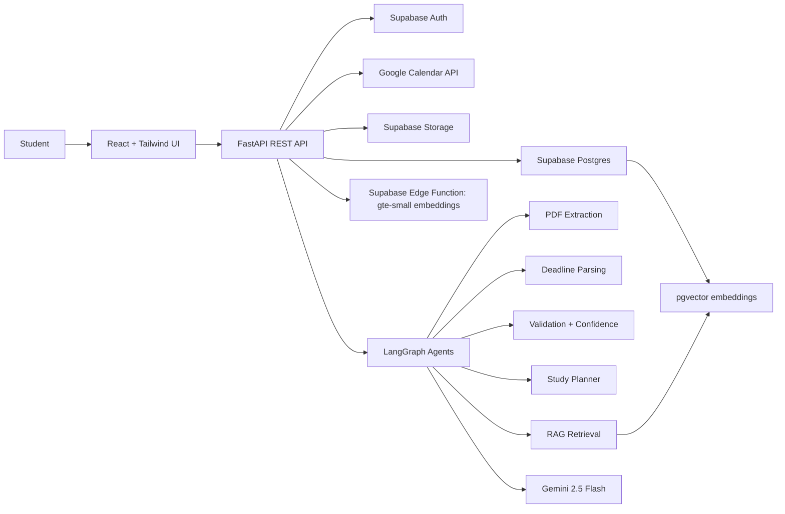

# Study Buddy Architecture

## Product Overview

Study Buddy helps students upload course documents, extract deadlines and grading policies, ask grounded questions over their PDFs, and receive personalized study plans. The architecture is designed for an internship-grade portfolio project that can grow into a multi-tenant SaaS application.

## System Architecture

## Backend Layers

- `api/`: FastAPI routers, request validation, auth dependencies, HTTP error handling.
- `agents/`: LangGraph orchestration for extraction, validation, retrieval, and planning.
- `rag/`: chunking, embedding, vector storage, retrieval, and grounded response generation.
- `services/`: business logic for documents, courses, assignments, analytics, and storage.
- `models/`: Pydantic request/response schemas and typed domain objects.
- `prompts/`: reusable AI prompt templates.
- `database/`: Supabase client setup and data-access helpers.
- `utils/`: logging, error helpers, file validation, shared utilities.
- `core/`: settings, app configuration, lifecycle, CORS, security primitives.

## Data Flow: PDF Upload To RAG

1. Student uploads a PDF from the React upload page.
2. FastAPI validates file type, size, and authenticated user ownership.
3. PDF is uploaded to Supabase Storage.
4. Text extraction runs with PyPDFLoader first and pdfplumber as fallback.
5. Text is chunked into semantically useful sections with page metadata.
6. Embeddings are generated for each chunk by a Supabase Edge Function using `gte-small`.
7. Chunks and vectors are stored in `document_chunks` using pgvector.
8. LangGraph runs extraction agents to parse deadlines, weights, and academic events.
9. Validation agent assigns confidence scores and flags uncertain rows for manual review.
10. Chat retrieval uses vector similarity plus course/user filters to ground responses.

## LangGraph Agent Responsibilities

- PDF Extraction Agent: extracts text, page ranges, and document metadata.
- Deadline Parsing Agent: identifies assignments, quizzes, exams, grading weights, due dates, and ambiguous date references.
- Study Planner Agent: creates weekly plans based on deadlines, difficulty, available hours, and workload.
- Retrieval Agent: retrieves relevant chunks and builds grounded context for chat.
- Validation Agent: checks extracted events against source chunks, assigns confidence scores, retries low-confidence extraction, and flags uncertain outputs.

## Scalability Decisions

- Async FastAPI endpoints keep upload, chat, and analytics APIs responsive.
- Long-running extraction should later move to a queue worker such as Celery, Dramatiq, or Supabase Edge Functions.
- Postgres row-level security keeps users isolated.
- pgvector indexes support semantic retrieval at scale, while embedding generation is isolated behind an Edge Function so the model provider can change later.
- Service boundaries make it straightforward to add caching, background jobs, observability, and billing later.
- Typed Pydantic schemas keep API contracts stable as the React client grows.
- Calendar export generates iCalendar files from upcoming verified deadlines, avoiding sensitive Google Calendar OAuth scopes for public recruiter demos.

## Frontend Architecture

- `components/`: reusable UI primitives and feature widgets.
- `pages/`: route-level screens for upload, chat, dashboard, analytics, and courses.
- `hooks/`: client-side data fetching and app state helpers.
- `services/`: API clients for FastAPI and Supabase.
- `layouts/`: authenticated app shell and public layouts.
- `context/`: auth/session/course context providers.

The UI should feel like a focused AI SaaS dashboard: dense enough for repeated student workflows, polished enough for interviews, and responsive across laptop and mobile layouts.
